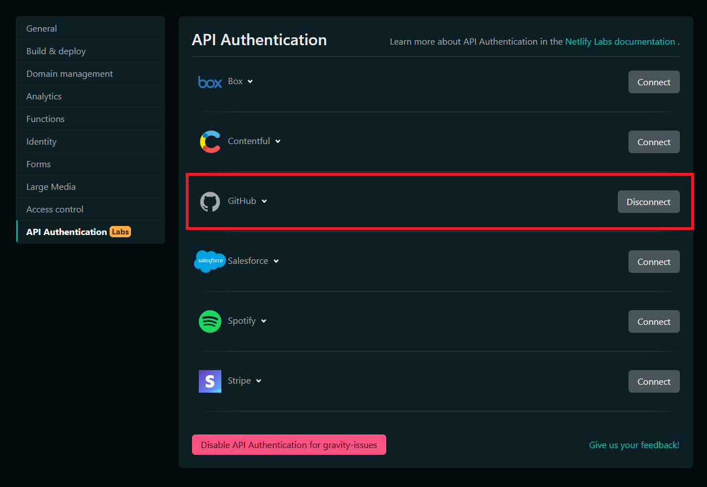

# ⭐ gravity

A web application that is able to connect the dots on most cross-referenced issues in a GitHub repository. It leverages [Netlify API Authentication](https://www.netlify.com/blog/2021/11/17/first-look-announcing-api-authentication-on-netlify/) to authenticate against GitHub.

## Running

To get the application running, you will need to deploy it to Netlify and ensure that you have connected GitHub to your **API Authentication** settings.

To get it working without Netlify API Authentication, you can re-write the [token acquisition mechanism](https://github.com/dend/gravity/blob/0c63698b33d0df0c2c642c375e68df0df484f533/gravity/pages/index.vue#L88-L89) to use your own secret logic instead of relying on data provided by Netlify.
